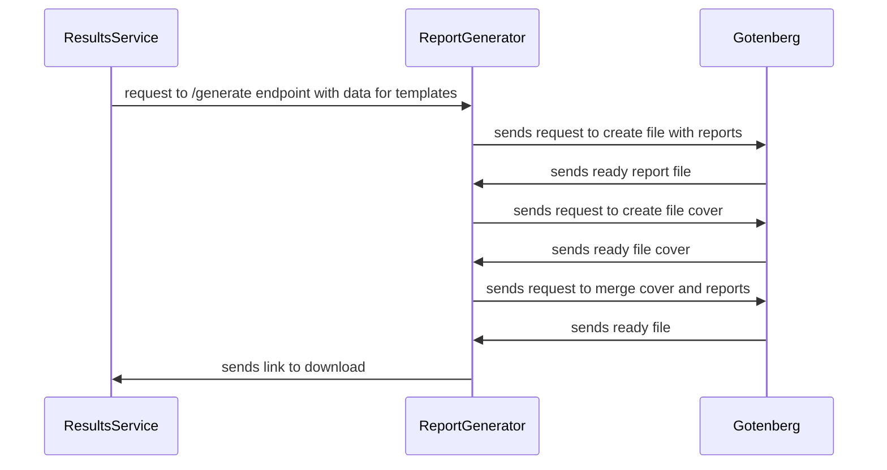

# Devsecops-Report-Generator
## Table of contents
<details open="open">
  <summary>Contents</summary>
  <ol>
    <li>
      <a href="#about-the-project">About project</a>
      <ol>
        <li><a href="#stack">Stack</a></li>
        <li><a href="#notes">Notes</a></li>
      </ol>
    </li>
    <li><a href="#running">Running</a></li>
    <li><a href="#envs">Envs</a></li>
    <li><a href="#flags">Flags</a></li>
    <li><a href="#configs">Configs</a></li>
    <li><a href="#architecture">Architecture</a></li>
    <li><a href="#maintainers">Maintainers</a></li>
  </ol>
</details>

## About The Project
Service that generates reports based on data from devsecops-results-service. It makes three calls to gotenberg, first to create pdf with reports pages, second call produces cover page, and thrid call merges two pdf files into one. The generator-service stores reports under reports volume then sends back download link.

### Stack
- Golang 1.17
- Gotenberg 7.5.3
- Docker 20.10.7
- Docker compose 1.29.2

### Notes
This project is specify due to [this](https://docs.google.com/document/d/1k54jS47Zt8cvGErBhnTS7JcGILyEz2b23t6DF-csrws/edit#heading=h.t97ky8m7ii0y) documentation

## Running
The project is made using docker containers
1. Set your env in docker-compose.yml file.
2. Run
```
$ docker-compose build
```
3. Run
```
$ docker-compose up
```
## Envs
List of all required envs. All envs must be set before build.
```
APP_MODE=
```
## Flags
List of all required flags. Flags are used to specify some app values that differ from default values.

```
--config=
```
--config - used to specify a config file destination.

## Configs
List of all required configs. All configs must be set before build.
```
server:
  port: 
  shutdown_time: 
generator:
  convert_url: 
  merge_url: 
  base_path: 
  timeout:
  templates:
    cover: 
    reports: 
    footer: 
  images:
    cover: 
    logo: 
    failed: 
    skipped: 
    passed: 
file_server:
  url_prefix: 
```

## Architecture


## Maintainers
- Developed by @erictronic
- Maintained by @erictronic
